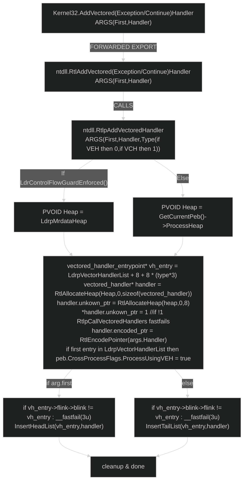

#  Win11 vectored handlers: Internals, dumping and manually registering
Written by: [DIMM](https://discordlookup.com/user/1335235086874054686)

I spent my days rotting behind a computer screen reversing ntdll 


## Index and intro

Hello and welcome to my first public blog!
Really excited to write this one, pretty cool subject :)
Today we're exploring vectored handlers!
Mainly VEH since i haven't really looked into VCH....
Anyway lets get into it!

WinVer: Windows 11 24h2 (Since this blog talks about ntdll its version-specific)

0. Index and intro
1. General workings of AddVectored(Exception/Continue)Handler
2. LdrpVectorHandlerList and how to exploit it
	2.1. Dumping vectored_handler structs
	2.2. RtlEncodePointer and RtlDecodePointer's inner workings
	2.3 VEH injection
4. IMPORTANT NOTES
5. References


# General workings


## Structures used:
```c++
//Both structures were found by reversing ntdll.RtlpAddVectoredHandler and ntdll.RtlpCallVectoredHandlers

//40 bytes (sizeof, ntdll.RtlpAddVectoredHandler RtlHeapAlloc call)
struct vectored_handler
{
	//aka a LIST_ENTRY instance
	vectored_handler* flink; //next handler to be called 
	vectored_handler* blink; //previous handler called
	uintptr_t* unkown_ptr;   //needs to be pointing to a QWORD with value 1
	PVOID unused;            //unused(?), this and unkown_ptr need more research
	PVOID encoded_ptr;       //encoded pointer to vectored handler code
};

// 16 bytes (sizeof)
struct vectored_handler_entrypoint // structure found at NTDLL+LdrpVectoredHandlerList+ 8 + 8 * (type*3)
{
    //first handler to be called
	//NOTE: the first handler to be called will have the address of the vectored_handler_entrypoint as blink
    vectored_handler* first;
    
	//last handler to be called 
	//NOTE: the last handler to be called will have the address of the vectored_handler_entrypoint as flink
	vectored_handler* last;
};

```

## Control flow (Simplified but accurate enough)



# LdrpVectorHandlerList and how to exploit it
  

## Dumping vectored_handler structs

So, as you have probably noticed i've been using a variable called LdrpVectorHandlerList in both my control flow chart and in the comments in my structures, and you've probably already noticed that it's a linked list (two actually) of VEH and VCH structures

LdrpVectorHandlerList  is a hardcoded offset into Ntdll as you can see in the screenshot below:


On my version of windows (win 11 24h2) the offset is 0x1E7568 for LdrpVectorHandlerList but we're actually interested in what comes after that, the two linked lists VEH_list and VCH_list

Now, as you've seen in the control flow chart, the calculation for vh_entry is LdrpVectorHandlerList + 8 + 8 * (type*3),
type = 1 for VCH and 0 for VEH

So then the final addresses are:
```c++
constexpr unsigned int LdrpVectorHandlerList = 0x1E7568; //win 11 24h2 offset
enum type
{
	VEH,
	VCH
};
std::uintptr_t ntdll = reinterpret_cast<std::uintptr_t>(GetModuleHandleA("ntdll.dll"));
vectored_handler_entry* VEH_entry = reinterpret_cast<vectored_handler_entry*>(ntdll + LdrpVectorHandlerList + 8 + 8 * (type::VEH * 3));
vectored_handler_entry* VCH_entry = reinterpret_cast<vectored_handler_entry*>(ntdll + LdrpVectorHandlerList + 8 + 8 * (type::VCH * 3));
```

LdrpAddVectoredHandler checks if the linked list points to itself when registering a VEH, if so it sets peb.CrossProcessFlags:ProcessUsingVEH (this does exactly what it  sounds like, it tells the exception handler that vectored exception handlers are present so it can call them)

So, now that you know how to locate the entries, you can really easily get the vectored_handler struct instances and now it becomes easy

Consider the following code:

```c++
#include "definitions.h"
int main()
{
	HANDLE process_handle = utils::get_process_handle("SomeProcess.exe");
	if(!process_handle)
	{
		std::puts("Error occured while opening process handle.\n")
		return -1;
	}
	
	std::uintptr_t external_ntdll = utils::get_module_base(process_handle,"ntdll.dll");
	utils::_PEB64 process_peb = utils::get_process_peb(process_handle);
	if(!process_peb)
	{
		std::puts("Error occured while reading process PEB.\n");
		CloseHandle(process_handle);
		return -2;
	}	
	
	if(!process_peb.ProcessUsingVEH)
	{
		std::puts("Process not using any VEHs!\n")
		CloseHandle(process_handle);
		return -3;
	}
	
	std::uintptr_t VEH_list_address = external_ntdll + LdrpVectorHandlerList + 8 + 8 * (type::VEH * 3);
	
	vectored_handler_entry vh_entry{};
	vectored_handler external_handler{};
	
	if(!utils::RPM(process_handle, VEH_list_address, vh_entry, sizeof(vh_entry))
	{
		std::puts("Error occured while reading external VEH_list.\n");
		CloseHandle(process_handle);
		return -4;
	}
	
	if(!utils::RPM(process_handle, vh_entry.first, external_handler,sizeof(external_handler))
	{
		std::puts("Error occured while getting VEH.\n");
		CloseHandle(process_handle);
		return -5;
	}
	
	std::puts("Successfully got VEH!\n");
	CloseHandle(process_handle);
	return 0;
}
```


Now, there's only one thing standing in your way, the encoded pointer to the VEH code address!

## RtlEncodePointer and RtlDecodePointer inner workings
These functions are so small i can just describe them right here right now, its basically just some fuckery with the process cookie

Here's the C pseudocode for RtlEncodePointer:

```c++
//names edited and symbols resolved for ease of reading
__int64 __fastcall RtlEncodePointer(__int64 pointer)
{
	ULONG cookie = RtlpGetCookieValue(); // process cookie, unique value generated on process creation
	if(!cookie)
	{
		NTSTATUS status= NtQueryInformationProcess(GetCurrentProcess(),36,&cookie,sizeof(cookie),0);
		if(!NT_SUCCESS(status))
			RtlRaiseStatus(status);
		//0x1D0450 is the offset to ?CookieValue@?1??RtlpGetCookieValue@@9@9 on win11 24h2
		//RtlpGetCookieValue call just resolves to mov rax,?CookieValue@?1??RtlpGetCookieValue@@9@9 afaik
		//so essentially ?CookieValue@?1??RtlpGetCookieValue@@9@9 = cookie
		*reinterpret_cast<ULONG*>((std::uintptr_t)GetModuleHandleA("ntdll.dll") + 0x1D0450) = cookie;
	}
	return __ROR8__(pointer ^ cookie, cookie & 0x3F);
}
```

and the actual assembly:
```nasm
;Generated via IDA->File->Produce file->Create ASM file
; __int64 __fastcall RtlEncodePointer(_QWORD)
public RtlEncodePointer
RtlEncodePointer proc near

return_length = qword ptr -18h
ProcessInformation= dword ptr  10h

push    rbx
sub     rsp, 30h
and     [rsp+38h+ProcessInformation], 0
mov     rbx, rcx
mov     eax, cs:?CookieValue@?1??RtlpGetCookieValue@@9@9 ; `RtlpGetCookieValue'::`2'::CookieValue
test    eax, eax
jz      short get_cookie_via_ntqueryinformationprocess

encode:
mov     ecx, eax
xor     rax, rbx
and     ecx, 3Fh
ror     rax, cl
add     rsp, 30h
pop     rbx
retn
align 2

get_cookie_via_ntqueryinformationprocess:
and     [rsp+38h+return_length], 0
lea     r8, [rsp+38h+ProcessInformation] ; ProcessInformation
mov     r9d, 4          ; ProcessInformationLength
or      rcx, 0FFFFFFFFFFFFFFFFh ; ProcessHandle
lea     edx, [r9+20h]   ; ProcessInformationClass
call    NtQueryInformationProcess
test    eax, eax
js      short error
mov     eax, [rsp+38h+ProcessInformation]
mov     cs:?CookieValue@?1??RtlpGetCookieValue@@9@9, eax ; `RtlpGetCookieValue'::`2'::CookieValue
jmp     short encode

error:
mov     ecx, eax
call    RtlRaiseStatus
db 0CCh
RtlEncodePointer endp
```

Now, im sure you already see something interesting, RtlEncodePointer's NtQueryInformationProcess uses a undocumented ProcessInformationClass, to get the cookie, neat!

Now we can get the process cookie!

We can also really easily edit RtlEncodePointer to take a cookie as argument, effectively making our own ``RtlEncodePointerEx(ULONG cookie, PVOID pointer)``!

Now for RtlDecodePointer, gonna keep it short since its basically the same as RtlEncodePointer

C Pseudocode:
```c++
__int64 __fastcall RtlDecodePointer(__int64 pointer)
{
	ULONG cookie = RtlpGetCookieValue();
	if(!cookie)
	{
		NTSTATUS status= NtQueryInformationProcess(GetCurrentProcess(),36,&cookie,sizeof(cookie),0);
		if(!NT_SUCCESS(status))
			RtlRaiseStatus(status);
		*reinterpret_cast<ULONG*>((std::uintptr_t)GetModuleHandleA("ntdll.dll") + 0x1D0450) = cookie;
	}
	return  __ROR8__(pointer, 64 - (cookie & 0x3F)) ^ cookie);
}
```

And the assembly:

```nasm
;Generated via IDA->File->Produce file->Create ASM file
public RtlDecodePointer
RtlDecodePointer proc near

ReturnLength= qword ptr -18h
ProcessInformation= dword ptr  10h

push    rbx
sub     rsp, 30h
mov     edx, cs:?CookieValue@?1??RtlpGetCookieValue@@9@9 ; `RtlpGetCookieValue'::`2'::CookieValue
xor     eax, eax
mov     [rsp+38h+ProcessInformation], eax
mov     rbx, rcx
test    edx, edx
jz      short get_cookie_via_ntqueryinformationprocess

decode:
mov     eax, edx
mov     ecx, 40h ; '@'
and     eax, 3Fh
sub     ecx, eax
mov     eax, edx
ror     rbx, cl
xor     rax, rbx
add     rsp, 30h
pop     rbx
retn
align 4

get_cookie_via_ntqueryinformationprocess:          ; ProcessInformationLength
mov     r9d, 4
mov     [rsp+38h+ReturnLength], rax ; ReturnLength
lea     r8, [rsp+38h+ProcessInformation] ; ProcessInformation
mov     rcx, 0FFFFFFFFFFFFFFFFh ; ProcessHandle
lea     edx, [r9+20h]   ; ProcessInformationClass
call    NtQueryInformationProcess
test    eax, eax
js      short error
mov     edx, [rsp+38h+ProcessInformation]
mov     cs:?CookieValue@?1??RtlpGetCookieValue@@9@9, edx ; `RtlpGetCookieValue'::`2'::CookieValue
jmp     short decode

error:
mov     ecx, eax
call    RtlRaiseStatus
db 0CCh
RtlDecodePointer endp
```


So now that you have the pseudocode and assembly for both RtlEncodePointer and RtlDecodePointer you probably already see how you can abuse them, since its purely arthritmic instructions to encode and decode the only thing you need is the process cookie, and you already know how to get it!

so, now you know how to get a vectored_handler instance and how to encode and decode pointers using another processes cookie, so now you can start dumping!

Here's a simple VEH address dumper:


```c++
//you can write these functions yourself now, i wont spoonfeed you :P
#include "definitions.h"
int main()
{
	HANDLE process_handle = utils::get_process_handle("RandomProcess.exe");
	vectored_handler external_handler = utils::get_first_handler(process_handle);
	
	if(!external_handler)
	{
		std::puts("No VEH found!\n");
		return -1;
	}
	
	ULONG process_cookie = utils::get_process_cookie(process_handle);
	
	if(!process_cookie)
	{
		std::puts("Error occured while fetching process cookie.\n")
		return -2;
	}
	
	std::uintptr_t VEH_address = utils::decode_ptr(process_cookie,external_handler.encoded_ptr);
	
	std::printf("Decoded VEH address: %p\n",VEH_address);
	return 1;
}
```

Easy enough right?
Now onto the REAL meat: Injecting a custom VEH!


## VEH injection
So, now that you've learned where VEH's are stored, what format they are stored in and how to get the process cookie to decode and encode pointers you can inject your own!


The theory for this is really **REALLY** simple:
1. Get address of vh_entry
2. If you want to be called first, get the vectored_handler struct at vh_entry.first, else get vh_entry.last
3. allocate memory into target process for 3 things:
	- The "function" (shellcode) that you want to be called
    - The handler struct itself
    - handler.unkown_ptr memory, 8 bytes, set to 1, LdrpCallVectoredHandlers bullshit
    
4. Setup handler struct
	- If first, copy vh_entry.first->blink into your handler.blink, and copy vh_entry.first into your handler.flink
	- If last, copy vh_entry.last->flink into your flink and copy vh_entry.last into your handler.blink
	- Encode the ptr to allocated shellcode memory and set handler.encoded_ptr to it
	- Set unkown_ptr to the memory you allocated for it
	
5. Write handler struct to allocated memory
6. Overwrite memory to put your handler into the linked list
	- If first, overwrite vh_entry.first->blink to contain the address of your handler struct and overwrite vh_entry.first to contain the address of your handler struct
	
	- If last, overwrite vh_entry.last->flink to contain the address of your handler struct and overwrite vh_entry.last to contain the address of your handler struct
7. Profit!

Now for the code ,you should've learned enough to do it yourself now, so i won't give it ;P

#  IMPORTANT NOTES
1. VEH's will not be called if peb.CrossProcessFlags:ProcessUsingVEH is not set

2. LdrpVectorHandlerList is PAGE_READONLY protected since its in mrdata, you might need to set protection to PAGE_READWRITE before ovewriting vh_entry!

4. This is NOT thread safe! The original RtlpAddVectoredHandler acquires an exclusive [SRW](https://learn.microsoft.com/en-us/windows/win32/sync/slim-reader-writer--srw--locks) lock on LdrpVectorHandlerList!


# References
[RtlAllocateHeap](https://learn.microsoft.com/en-us/windows-hardware/drivers/ddi/ntifs/nf-ntifs-rtlallocateheap)
[InsertHead/TailList](https://doxygen.reactos.org/dd/df3/env__spec__w32_8h.html#a14f3c1fe642e4927959b4beed2852e2a)
[__fastfail](https://learn.microsoft.com/en-us/cpp/intrinsics/fastfail?view=msvc-170)
[_PEB64](https://www.vergiliusproject.com/kernels/x64/windows-11/24h2/_PEB64)

